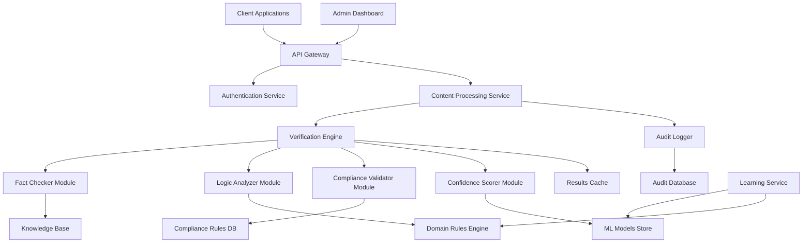

# CertaintyAI - Design Document

## Overview

CertaintyAI is a comprehensive AI hallucination detection system designed to integrate seamlessly into enterprise workflows. The system employs multiple verification techniques including fact-checking against knowledge bases, logical consistency analysis, compliance rule validation, and confidence scoring to identify and flag potentially erroneous AI-generated content before it reaches end users.

The architecture follows a microservices pattern with real-time processing capabilities, domain-specific learning modules, and comprehensive audit logging to meet enterprise compliance requirements.

## Architecture

### High-Level Architecture



### Core Components

1. **API Gateway**: Entry point for all client requests with rate limiting and routing
2. **Authentication Service**: Enterprise SSO integration and API key management
3. **Content Processing Service**: Document parsing and content extraction
4. **Verification Engine**: Orchestrates all verification modules
5. **Knowledge Base**: Curated factual information for fact-checking
6. **Domain Rules Engine**: Industry-specific validation rules
7. **Compliance Rules Database**: Regulatory requirements and policies
8. **ML Models Store**: Machine learning models for pattern recognition
9. **Audit Logger**: Comprehensive logging for compliance tracking
10. **Learning Service**: Continuous improvement through feedback analysis

## Components and Interfaces

### API Gateway Interface

```typescript
interface APIGateway {
  // Document verification endpoint
  POST /api/v1/verify
  {
    content: string | File,
    contentType: 'text' | 'pdf' | 'docx' | 'json',
    domain: 'legal' | 'financial' | 'healthcare' | 'insurance',
    urgency: 'low' | 'medium' | 'high',
    metadata?: Record<string, any>
  }

  // Batch verification endpoint
  POST /api/v1/verify/batch
  {
    documents: Array<{
      id: string,
      content: string | File,
      contentType: string,
      domain: string
    }>
  }

  // Get verification results
  GET /api/v1/results/{verificationId}

  // Provide feedback for learning
  POST /api/v1/feedback
  {
    verificationId: string,
    feedback: 'correct' | 'incorrect' | 'partial',
    corrections?: string,
    expertNotes?: string
  }
}
```

### Verification Engine Interface

```typescript
interface VerificationEngine {
  verifyContent(request: VerificationRequest): Promise<VerificationResult>

  interface VerificationRequest {
    content: ParsedContent
    domain: Domain
    urgency: UrgencyLevel
    metadata: ContentMetadata
  }

  interface VerificationResult {
    verificationId: string
    overallConfidence: number // 0-100
    riskLevel: 'low' | 'medium' | 'high' | 'critical'
    issues: Issue[]
    auditTrail: AuditEntry[]
    processingTime: number
    recommendations: string[]
  }

  interface Issue {
    type: 'factual_error' | 'logical_inconsistency' | 'compliance_violation'
    severity: 'low' | 'medium' | 'high' | 'critical'
    location: TextLocation
    description: string
    evidence: string[]
    suggestedFix?: string
    confidence: number
  }
}
```

### Domain-Specific Modules

```typescript
interface DomainModule {
  validateContent(content: ParsedContent): Promise<ValidationResult>;
  updateRules(newRules: DomainRule[]): Promise<void>;
  learnFromFeedback(feedback: FeedbackData): Promise<void>;
}

interface LegalModule extends DomainModule {
  validateContractTerms(
    terms: ContractTerm[]
  ): Promise<ValidationResult>;
  checkLegalCompliance(
    content: string,
    jurisdiction: string
  ): Promise<ComplianceResult>;
}

interface FinancialModule extends DomainModule {
  validateNumericalAccuracy(
    calculations: Calculation[]
  ): Promise<ValidationResult>;
  checkRegulatoryCompliance(
    content: string,
    regulations: string[]
  ): Promise<ComplianceResult>;
}

interface HealthcareModule extends DomainModule {
  validateMedicalAccuracy(content: string): Promise<ValidationResult>;
  checkHIPAACompliance(content: string): Promise<ComplianceResult>;
}
```

## Data Models

### Core Data Models

```typescript
interface ParsedContent {
  id: string;
  originalContent: string;
  extractedText: string;
  contentType: ContentType;
  structure: DocumentStructure;
  entities: ExtractedEntity[];
  metadata: ContentMetadata;
  createdAt: Date;
}

interface DocumentStructure {
  sections: Section[];
  tables: Table[];
  figures: Figure[];
  references: Reference[];
}

interface ExtractedEntity {
  type:
    | 'person'
    | 'organization'
    | 'date'
    | 'amount'
    | 'regulation'
    | 'medical_term';
  value: string;
  confidence: number;
  location: TextLocation;
  context: string;
}

interface VerificationSession {
  id: string;
  userId: string;
  organizationId: string;
  contentId: string;
  domain: Domain;
  status: 'processing' | 'completed' | 'failed';
  results: VerificationResult;
  feedback?: FeedbackData;
  createdAt: Date;
  completedAt?: Date;
}

interface AuditEntry {
  id: string;
  sessionId: string;
  timestamp: Date;
  action: string;
  component: string;
  details: Record<string, any>;
  userId?: string;
}

interface FeedbackData {
  verificationId: string;
  userFeedback: 'correct' | 'incorrect' | 'partial';
  corrections?: string;
  expertNotes?: string;
  userId: string;
  timestamp: Date;
}
```

### Knowledge Base Models

```typescript
interface FactualClaim {
  id: string;
  statement: string;
  sources: Source[];
  confidence: number;
  domain: Domain;
  lastVerified: Date;
  contradictions?: string[];
}

interface Source {
  id: string;
  url?: string;
  title: string;
  author?: string;
  publishDate?: Date;
  credibilityScore: number;
  sourceType:
    | 'academic'
    | 'government'
    | 'industry'
    | 'news'
    | 'internal';
}

interface ComplianceRule {
  id: string;
  ruleText: string;
  regulation: string;
  jurisdiction: string;
  domain: Domain;
  severity: 'low' | 'medium' | 'high' | 'critical';
  examples: string[];
  lastUpdated: Date;
}
```

## Error Handling

### Error Classification

1. **System Errors**: Infrastructure failures, service unavailability
2. **Validation Errors**: Invalid input format, missing required fields
3. **Processing Errors**: Content parsing failures, timeout errors
4. **Integration Errors**: External service failures, authentication issues

### Error Response Format

```typescript
interface ErrorResponse {
  error: {
    code: string;
    message: string;
    details?: Record<string, any>;
    timestamp: Date;
    requestId: string;
    retryable: boolean;
  };
}

// Example error codes
const ERROR_CODES = {
  INVALID_CONTENT_TYPE: 'INVALID_CONTENT_TYPE',
  PROCESSING_TIMEOUT: 'PROCESSING_TIMEOUT',
  KNOWLEDGE_BASE_UNAVAILABLE: 'KNOWLEDGE_BASE_UNAVAILABLE',
  INSUFFICIENT_PERMISSIONS: 'INSUFFICIENT_PERMISSIONS',
  RATE_LIMIT_EXCEEDED: 'RATE_LIMIT_EXCEEDED',
};
```

### Fallback Strategies

1. **Graceful Degradation**: If advanced verification fails, provide basic checks
2. **Cached Results**: Return previous results for similar content when services are down
3. **Manual Review Queue**: Route failed verifications to human experts
4. **Retry Logic**: Exponential backoff for transient failures

## Testing Strategy

### Unit Testing

- **Verification Modules**: Test each verification algorithm independently
- **Data Models**: Validate serialization/deserialization and business logic
- **API Endpoints**: Test request/response handling and validation
- **Domain Rules**: Verify rule application and edge cases

### Integration Testing

- **End-to-End Workflows**: Complete verification process from API to results
- **External Dependencies**: Mock knowledge bases and compliance databases
- **Performance Testing**: Load testing with realistic document volumes
- **Security Testing**: Authentication, authorization, and data protection

### Domain-Specific Testing

```typescript
interface TestSuite {
  // Legal domain tests
  testContractVerification(): void;
  testLegalComplianceChecking(): void;

  // Financial domain tests
  testNumericalAccuracy(): void;
  testFinancialRegulationCompliance(): void;

  // Healthcare domain tests
  testMedicalFactChecking(): void;
  testHIPAACompliance(): void;

  // Cross-domain tests
  testMultiDomainContent(): void;
  testDomainConflictResolution(): void;
}
```

### Performance Benchmarks

- **Response Time**: < 2 seconds for single document verification
- **Throughput**: 10,000+ documents per hour
- **Accuracy**: > 95% precision and recall for known error types
- **Availability**: 99.9% uptime with automatic failover

### Continuous Learning Validation

- **A/B Testing**: Compare model versions on real enterprise data
- **Feedback Loop Testing**: Verify that user feedback improves accuracy
- **Drift Detection**: Monitor for changes in content patterns or accuracy
- **Bias Testing**: Ensure fair treatment across different content types and domains

## Security and Compliance

### Data Protection

- **Encryption**: All data encrypted in transit (TLS 1.3) and at rest (AES-256)
- **Access Control**: Role-based permissions with principle of least privilege
- **Data Retention**: Configurable retention policies per compliance requirements
- **Anonymization**: PII detection and optional anonymization for audit logs

### Compliance Framework

- **SOC 2 Type II**: Security, availability, and confidentiality controls
- **GDPR**: Data subject rights and privacy by design
- **HIPAA**: Healthcare data protection (when applicable)
- **Industry Standards**: Domain-specific compliance (SOX, Basel III, etc.)

### Audit and Monitoring

- **Real-time Monitoring**: System health, performance metrics, and security events
- **Audit Logging**: Immutable logs of all verification activities
- **Compliance Reporting**: Automated generation of compliance reports
- **Incident Response**: Automated alerting and response procedures
